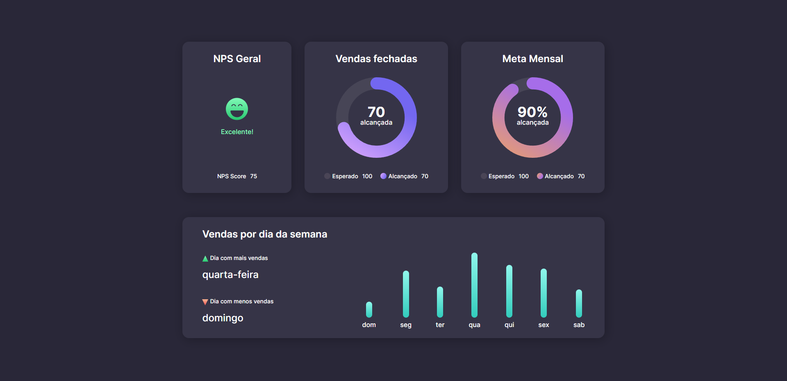

<h1 align="center">📊 Dashboard</h1>

 

    <a href="https://elias-neto.github.io/boracodar-dashboard" target="_blank"> Veja o Site</a>

 

## 💻 Projeto

Esse desafio foi proposto pelo [#boraCodar](https://www.rocketseat.com.br/boracodar) da [Rocketseat](https://www.rocketseat.com.br/).

 

## 📥 Conhecimento adquirido

- Fundamentos do HTML;
- Fundamentos de CSS;
- Trabalhar com SVG;

 

## 🛠 Tecnologias usadas

O projeto foi desenvolvido utilizando as seguintes tecnologias:

- [HTML](https://www.w3schools.com/html/)
- [CSS](https://www.w3schools.com/css/)
- [Figma](https://www.figma.com/design/)

 
 

 Desenvolvido com ❤ por Elias Neto 👋 

